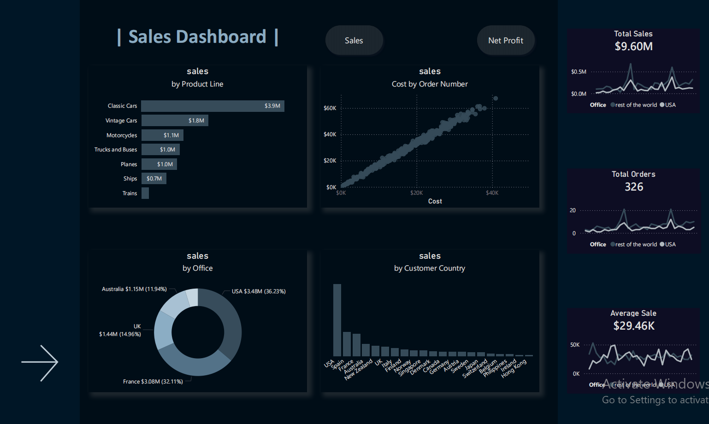
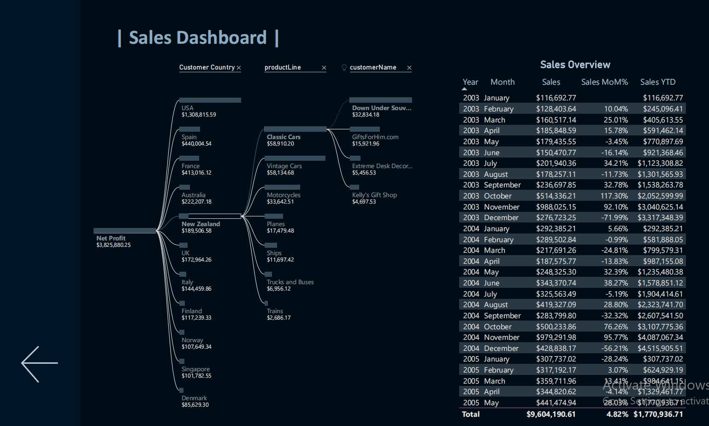

# Classic Models — Sales Analysis & Dashboard
### Tools: MySQL · Excel (Pivot Tables) · Power BI · DAX

A full end-to-end analytics project on the Classic Models automotive 
database — from raw relational data through SQL analysis and Excel 
pivot tables to an interactive Power BI dashboard.

---

## Project Pipeline

---

## Dashboard Preview

*Page 1 — KPI cards, product line bar, scatter, donut, column charts*

*Page 2 — Net profit decomposition tree + MoM/YTD sales table*

---

## Data Source

- **Database:** Classic Models MySQL relational database (`classicmodels`)
- **Tables:** 8 tables — `customers`, `employees`, `offices`, 
  `orderdetails`, `orders`, `payments`, `productlines`, `products`
- **Full database script:** `sql/00_classicmodels_database.sql`

---

## Part 1 — SQL Analysis (8 Queries → Excel)

Before building the dashboard, the database was analysed using 8 SQL 
queries covering sales performance, customer behaviour, and operational 
metrics. Results were loaded into Excel with pivot tables and charts.

| File | Sheet in Excel | Analysis |
|---|---|---|
| `01_view_for_powerbi.sql` | Sales data | Master view: 2,997 rows joining all 8 tables — orders, products, customers, offices |
| `02_sales_overview_by_product.sql` | Product Overview | Sales, cost, net profit by product line with 3 bar charts |
| `03_office_sales.sql` | profit / customer-office | Sales & net profit % by country; customer country vs office country breakdown |
| `04_credit_limit_segmentation.sql` | credit limit | Sales segmented into 4 credit limit bands (<$75k, $75–100k, $100–150k, $150k+) |
| `05_customer_sales_change.sql` | consecutive order diff | LAG window function — tracks sales value change between each customer's consecutive orders |
| `06_customers_over_credit_limit.sql` | — | Running total of sales vs payments using window functions to identify customers approaching or exceeding credit limit |
| `07_late_shipping_analysis.sql` | — | Flags orders where shipped date + 3 days exceeds required date |
| `08_product_line_couples.sql` | product couples | Self-join to find which product lines are most frequently ordered together |

**Advanced SQL techniques used:** CTEs, Window Functions (LAG, LEAD, SUM OVER, ROW_NUMBER), self-joins, CASE statements, date arithmetic, subqueries

---

## Part 2 — Power BI Dashboard

A MySQL view (`sales_data_pb`) was created from the master query and 
imported into Power BI as the data source for the dashboard.

### Page 1 — Sales Overview

| Visual | Type | Fields |
|---|---|---|
| Total Sales | KPI card + sparkline | SUM(sales) |
| Total Orders | KPI card + sparkline | COUNT(orderNumber) |
| Average Sale Value | KPI card + sparkline | [Average Sale Value] |
| Sales by Product Line | Bar chart | productLine, [selected metric] |
| Cost vs Revenue | Scatter | [selected metric], cost_of_sales, orderNumber |
| Sales by Office Country | Donut | officeCountry, [selected metric] |
| Sales by Customer Country | Column | customerCountry, [selected metric] |

### Page 2 — Profit Decomposition

| Visual | Type | Description |
|---|---|---|
| Decomposition tree | Tree | [Net Profit] → customerCountry → productLine → customerName |
| Sales trend table | Table | Sales, [Sum of sales MoM%], [Sum of sales YTD] |

### DAX Measures

| Measure | Purpose |
|---|---|
| `[Average Sale Value]` | Total sales ÷ total orders |
| `[Net Profit]` | Sales minus cost_of_sales |
| `[Sum of sales MoM%]` | Month-over-month % change |
| `[Sum of sales YTD]` | Year-to-date cumulative sales |
| `[selected metric]` | Dynamic switcher across all visuals |

---

## Key Insights

- **Classic Cars and Vintage Cars** account for 55%+ of total revenue
- **3 markets** contribute less than 5% of total sales
- Credit limit segmentation reveals highest sales volume comes from 
  the **$100k–$150k** customer band
- LAG analysis shows significant variance in consecutive order values 
  — some customers show 3x swings between orders
- Product line coupling analysis shows **Classic Cars** appear in the 
  majority of multi-line orders

---

## Files

| File/Folder | Description |
|---|---|
| `sql/` | All 8 SQL query files + full database script |
| `Sales.xlsx` | Excel workbook: 7 sheets with pivot tables and charts |
| `screenshots/` | Power BI dashboard screenshots |

**[▶ View live dashboard on Power BI](https://app.powerbi.com/view?r=eyJrIjoiNGI3YTk0NzgtNjYxMC00ZDlkLWExMWQtMTZhNjQzOGEwZTljIiwidCI6ImVhZjYyNGM4LWEwYzQtNDE5NS04N2QyLTQ0M2U1ZDc1MTZjZCIsImMiOjh9)**
